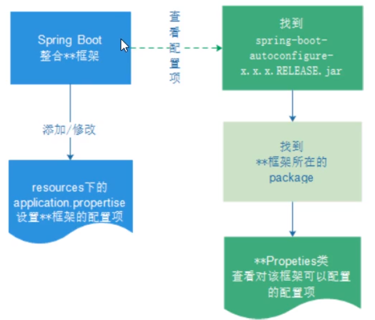

Hello springBoot

## 一. 可以在浏览器中访问http://localhost:8080/hello 

    1. 创建工程
    2. 添加依赖（启动器依赖，spring-boot-starter-web启动引导类）
    3. 创建启动类Application
    4. 创建处理器controller

    summary：
    spring-boot-starter-web的默认的应用服务器端口是8080

## 二. java代码方式配置
    
    1.使用 @Value 获取配置文件配置项并结合 @bean 注册组件到Spring
        核心思想: spring boot 中鼓励使用注解配置完全取代xml配置
    
   Java配置主要靠java类和一些注解，比较常用的注解有
   
   * @Configuration: 声明一个类作为配置，代替xml文件
   * @Bean: 声明在方法上，将方法的返回值加入bean容器，代替\<bean>标签
   * @Value: 属性注入
   * @PropertySource: 指定外部的属性文件

    配置数据库连接池
    1. 添加依赖
    2. 创建数据库
    3. 创建数据库连接参数的配置文件 jdbc.properties
    4. 创建配置类 @Configuration
    5. 改造处理器类注入数据源并使用
## 三. Spring Boot属性注入方式
    
    @Value注入只能一条一条注，而且只能注入静态变量
    @ConfigurationProperties更高级，可以将配置文件（默认的名称必须为application.properties或application.yml)
    中的配置项读取到一个对象中
    
1. 创建配置项类jdbcProperties类，带有注解@ConfigurationProperties
2. 创建application.properties配置文件
3. 将jdbcProperties对象注入到jdbcConfig

    @ConfigurationProperties的优势：
    * 松散绑定，不严格要求属性文件类中的属性名和成员变量名一致。支持驼峰，中划线，下划线转换，甚至支持对象引导，比如 user.friend.name：代表user对象中的friend属性对象中的name属性，这一点@Value做不到
    * meta-data support： 元数据支持，帮助ide生成属性提示（以后写开源框架会用）

更优雅的注入
---
其实spring boot可以直接跳过JdbcProperties这个类的工作， 直接把@ConfigurationPropertis加到目标类上，springboot会自动调用目标对象的set方法把对应的属性注入，所以前提就是目标对象有相应的注入方法
比如DataSource有setDriverClassName的方法，配置文件有driverClassName属性，必须对的上
---
使用多个yaml文件配置
---
除了文件展示方式不同之外，其他的功能作用和properties是一样的，在项目中读取的格式不需要改变

多个yml配置文件在spring boot中是被允许的。这些配置文件的名字必须为 application-***.yml，并且配置文件必须要在 application.yml 中激活后才可以使用
    
    spring:
     profiles:
      active:

如果properties和yml同时存在spring boot中，这两个配置文件都有效，如果存在同名配置项，则以properties的属性值优先

## 四、自动配置原理
1. 在 META-INF\spring.factories文件中定义了很多自动配置类，可以根据在pom.xml文件中添加的 启动器依赖(spring boot autoconfiguration) 自动配置组件
2. 通过如下流程可以去修改application配置文件，改变自动配置的组件默认参数

## 五、lombok

lombok是一个插件工具包，提供了一些注解@Data(生成get/set/hashCode/equals/toString等方法), @Getter, @Setter, @Slf4j(日志，提供Log对象)等这些注解去简化pojo实体类中的构造方法get/set等方法的编写
 1. 在IDE中安装lombok插件
 2. 添加lombok依赖到pom.xml
 3. 改造实体类